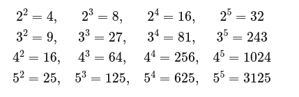

## <center> Национальный исследовательский университет информационных технологий, механики и оптики </center> 
### <center> Факультет Программной Инженерии и Компьютерной Техники </center> 
----
 <br /> 
 <br />
 <br />

## <center> Лабораторная работа 1 </center>

### <center>Вариант №2, 29</center>

### <center>«Функциональное программирование»</center>

<div style="text-align: right"> 

Работу выполнила:

Студентка группы P3212

Сенина Мария Михайловна

Преподаватель:

Пенской Александр Владимирович
</div>


<center>Санкт-Петербург</center>
<center>2023</center>

<div style="page-break-after: always; visibility: hidden">pagebreak</div>

# Описания задач

## Задача 2 чётные числа Фибоначи

Каждый новый член последовательности Фибоначи образован двумя предыдущими. Последовательность начинается с 1 и 2. 
Первые 10 членов:
1 ,2 ,3 ,5 ,8 ,13 ,21 ,34 ,55 ,89

Найдите сумму чётных значений членов последовательности Фибоначи, которые будут меньше 4х миллионов.

## Решение

В начале я решила задачу в лоб через циклы:

```lisp
(defun solve2_array ()
    (loop for a = 1 then b and b = 1 then (+ a b) 
        while (< a 4000000) 
        when (evenp a) sum a
    )
)
```
В данном случае я генерирую список пока одна из переменных цикла не превысит 4х миллионов.


Далее я сделала рекурсивное решение. Мы генерируем последовательность Фибаначи рекурсивно, и если член чётный добавляем его уже к накопившемуся результату.
```lisp
(defun solve2_recursion (a b)
  (if (< b 4000000) (+ (solve2_recursion b (+ a b)) (if (evenp b) b 0)) 0))
```

В этом примере мы пользуемся функциями map и reduce применённым к списку из членов последовательности Фибаначи.
С помощью map мы заменяем нечётные значения на нули, а с помощью reduce мы суммируем все элементы списка.
```lisp
(defun solve2_map () ;все числа от 1 1 до 4000000
    (reduce #'+ (mapcar #'(lambda(x) (if (evenp x) x 0)) (loop for a = 1 then b and b = 1 then (+ a b)
                        while (< a 4000000)
                        collect a))
    )
)
```

При этом на питоне тот же код "в лоб" выглядит вот так:
```python
cur = 1
next = 1
res = 0
while cur < 4000000:
    sum = cur + next
    cur = next
    next = sum
    if cur % 2 == 0:
        res += cur
print(res)
```

## Задача 29 различные степени

Все комбинации a^b такие что 2<= a, b <= 5



Если затем расположить их в числовом порядке, удалив все повторы, мы получим следующую последовательность из 15 различных чисел:

4, 8, 9, 16, 25, 27, 32, 64, 81, 125, 243, 256, 625, 1024, 3125.

Сколько таких чисел получится, если 2<= a, b <= 100?

## Решение

Первая реализация снова "в лоб" через циклы. Я с помощью функции pushnew кладу в лист только различные элементы, а дальше их суммирую.
```lisp
(defun solve29_array ()
    (let ((res (list)))
    (loop for a from 2 to 100 append (loop for b from 2 to 100 do (pushnew (expt a b) res)))
    (loop :for i :in res :counting t)
    )
)
```

В этом примере я написала свою рекурсивную функцию, которая удаляет дубликаты. 
Пользуясь ей я создаю список подходящих мне степеней и в нём с помощью map все элементы преврщаю в единицы и складываю их с помощью reduce.

```lisp
(defun rm_dublicates (list)
    (cond
        ((null list) nil)
        ((member (car list) (cdr list)) (rm_dublicates (cdr list)))
        (t (cons (car list) (rm_dublicates (cdr list))))))

(defun solve29_map ())
    (reduce #'+
      (mapcar (lambda(x) 1)
        (rm_dublicates
          (loop for a from 2 to 100 append 
            (loop for b from 2 to 100 
              collect (expt a b)
            )
          )
        )
      )
)
```

# Выводы

В этой лаборатороной работе я познакомилась с базовым синтаксисом comman lisp. 
Разобралась, как здесь работать со списками, циклами, свёрткой и как тут писать реурсию. 
Больше всего проблем у меня вызвала настройка окружения и тестирования. 